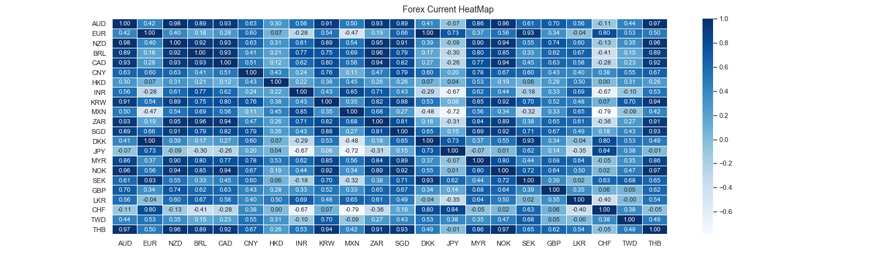

# FOREX DATA ETL

## Heat Map - Data Story for FOREX

## Pre-requisites

  1. Python
  2. Pandas
  3. psycopy2
  4. django
  5. postgresql

## To run the Django PROJECT
python3 manage.py runserver

It opens the Django in its default port:

Django Admin Super User:
User: gtuser
Password: rpython

## "postgresql" used in this project is from Google Cloud and the access is restricted from GeorgiaTech IP only.

## For Public Access Please update the settings.py
"DATABASE"
